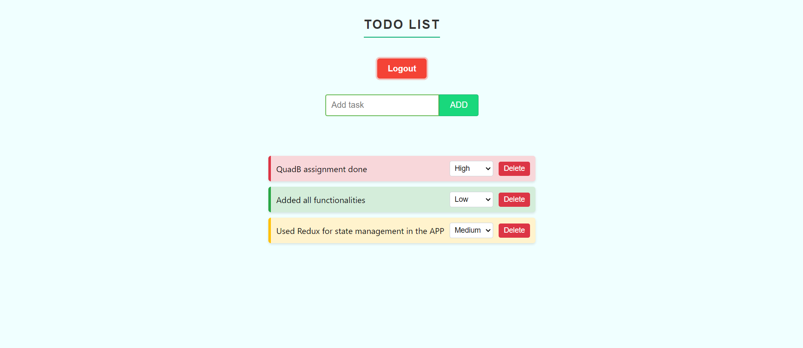

Mobile view of app

Desktop view of app

Features
Add Task: Easily create new tasks with a user-friendly interface.
View Tasks: See all your tasks in a clean, organized list.
Delete Task: Remove completed or unnecessary tasks with a single click.
Task Prioritization: Assign priority levels to tasks for better organization.
Persistent Storage: Tasks are saved locally, ensuring data persistence across sessions.
Responsive Design: Optimized layout for both mobile and desktop views.
User Authentication: Secure login/logout functionality to protect user data.

Installation and Setup
Clone the repository:
git clone https://github.com/Himanshusaini12/To-Do_QuadB.git

Navigate to the project directory:
cd To-Do_QuadB

Install dependencies:
npm install

Start the development server:
npm start

Open your browser and visit http://localhost:3000 to view the app.