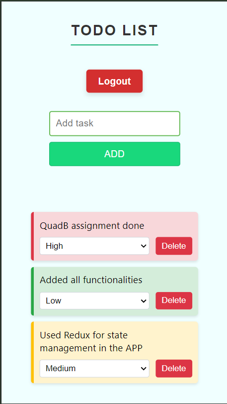

# To-Do_QuadB

A simple and intuitive to-do list application built with React.

## Screenshots

### Mobile View

### Desktop View

## Features

- **Add Task:** Easily create new tasks with a user-friendly interface.
- **View Tasks:** See all your tasks in a clean, organized list.
- **Delete Task:** Remove completed or unnecessary tasks with a single click.
- **Task Prioritization:** Assign priority levels to tasks for better organization.
- **Persistent Storage:** Tasks are saved locally, ensuring data persistence across sessions.
- **Responsive Design:** Optimized layout for both mobile and desktop views.
- **User Authentication:** Secure login/logout functionality to protect user data.

## Installation and Setup

1. Clone the repository:

git clone https://github.com/Himanshusaini12/To-Do_QuadB.git

2. Navigate to the project directory:

cd To-Do_QuadB

3. Install dependencies:

npm install

4. Start the development server:

npm start

5. Open your browser and visit `http://localhost:3000` to view the app.

